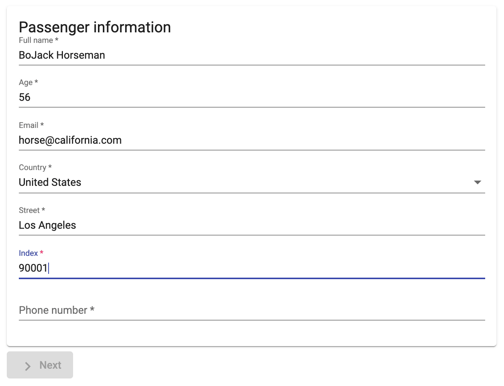

Passengers
==========

This application is a two-steps form written with Angular and TypeScript. 
The form maintains its state between steps and validates the users input.

The form is accessible on [this link](https://shpotainna.github.io/passengers/).

